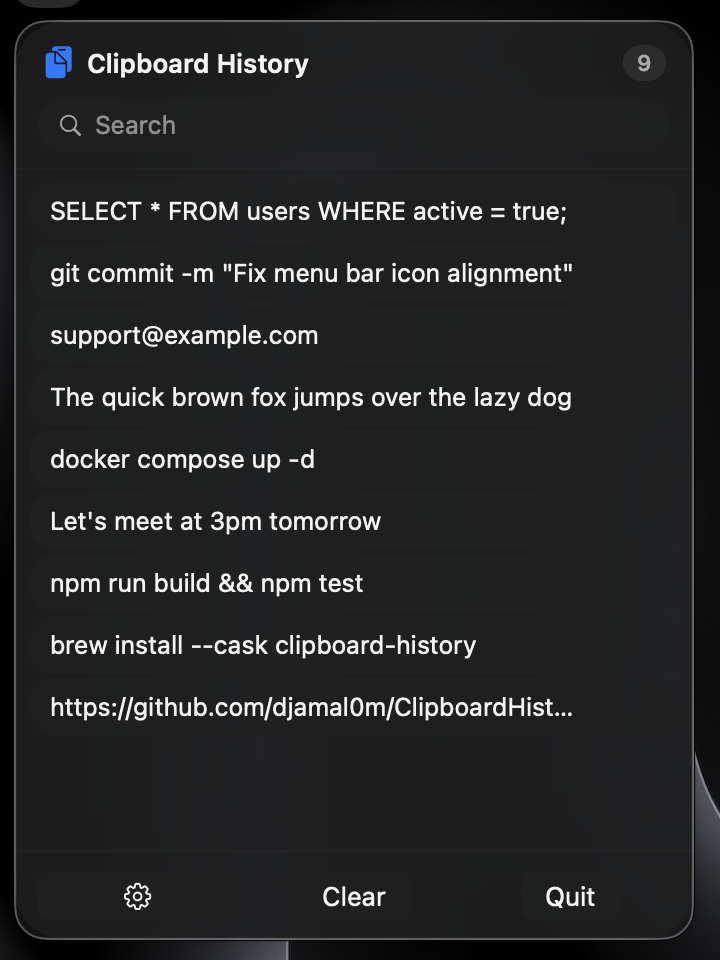
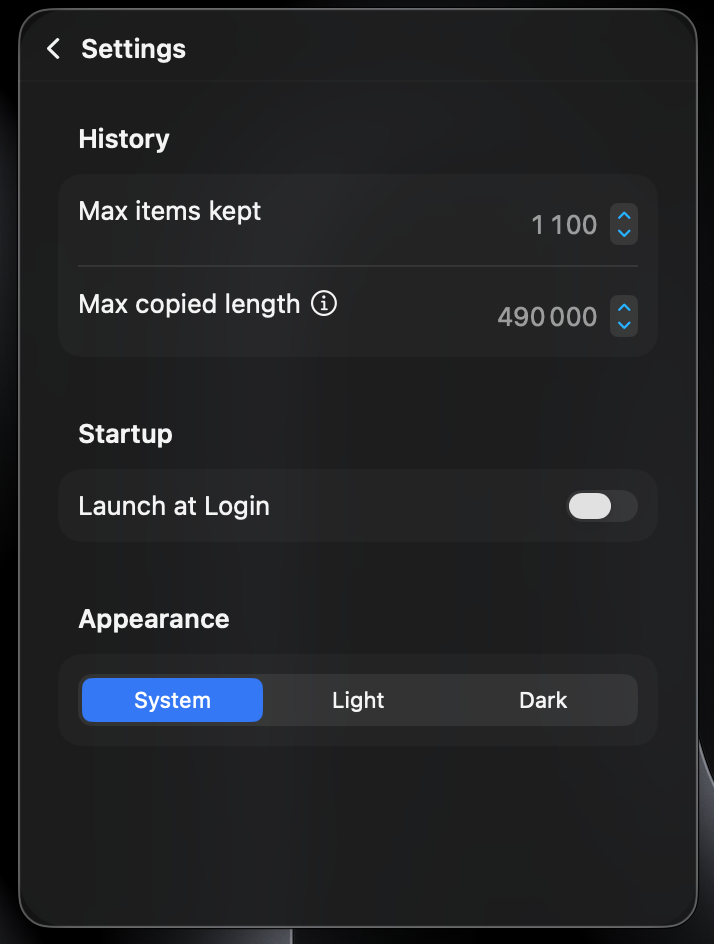

# Clipboard History

[](#requirements)
[](#requirements)
[](LICENSE)

A lightweight macOS menu bar app that keeps a searchable history of everything you copy.




## Features

- Lives in the menu bar — no dock icon, no clutter
- Automatically saves your clipboard history as you copy
- Search through past items instantly
- Copies images and files too, with a thumbnail or icon preview
- Hover a long entry to see the full text in a preview panel
- Click any item to copy it again (and the popover closes for you)
- Configurable history size and max item length
- Light / Dark / System appearance
- Optional launch at login
- 100% local — nothing ever leaves your machine

## Requirements

- macOS 26 or later
- Swift 6.2 toolchain (Xcode or Command Line Tools)

## Install

Clone the repo and run the build script, which compiles a release build, installs it to `~/Applications/Clipboard History.app`, code-signs it, and launches it:

```bash
git clone https://github.com/djamal0m/ClipboardHistory.git
cd ClipboardHistory
./build.sh
```

Click the clipboard icon in the menu bar to open it.

## Development

Build without installing:

```bash
swift build
```

Run the test suite:

```bash
swift test
```

## Project Structure

```
Sources/
  ClipboardHistoryCore/   Platform-agnostic history logic (no UI, fully unit tested)
  ClipboardHistory/       SwiftUI menu bar app (views, settings, app entry point)
Tests/
  ClipboardHistoryCoreTests/  Tests for the core logic
  ClipboardHistoryTests/      Tests for the app layer
```

## How It Works

The app polls the system pasteboard for changes and stores new text entries locally in `~/Library/Application Support/ClipboardHistory/history.json`. Nothing leaves your machine.

## Contributing

Issues and pull requests are welcome. If you're proposing a larger change, open an issue first to discuss what you'd like to change.

## License

[MIT](LICENSE)
